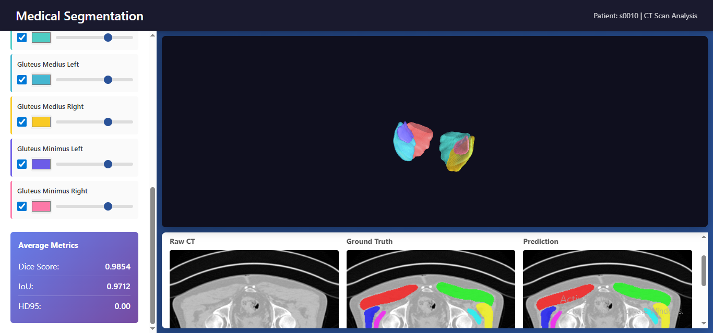
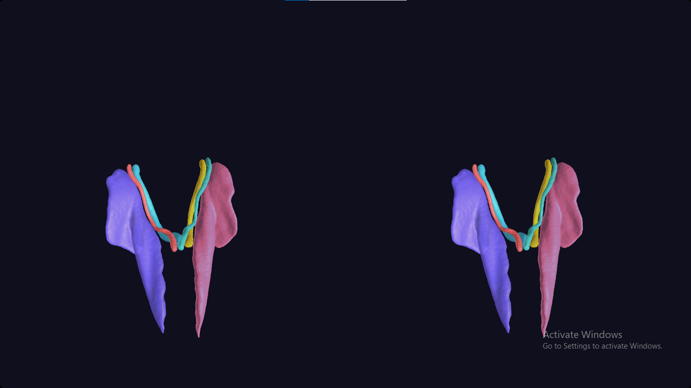

# Medical Image Segmentation Visualization Platform

A comprehensive web-based platform for visualizing, comparing, and evaluating AI-powered medical image segmentation models on whole-body CT scans. This tool provides interactive 3D visualization, 2D slice inspection, and quantitative performance metrics for multiple state-of-the-art segmentation models.

## Demo Video

[Watch Demo Video](https://drive.google.com/file/d/1Xu1ydiyI9h1_rTBgqpbKc5EHZQngdqMm/view?usp=drive_link)

## Screenshots

### 3D Visualization


### VR Mode


## Features

### 🎯 Multi-Model Comparison
- **TotalSegmentator**: Industry-standard whole-body CT segmentation
- **MONAI Wholebody CT Segmentation**: High-performance medical imaging model
- **MedIm STU-Net**: Advanced neural network architecture for medical segmentation

### 🔬 Interactive 3D Visualization
- Real-time 3D rendering of segmented organs using Three.js
- Intuitive mouse controls (rotate, zoom, pan)
- Individual organ visibility toggles
- Customizable colors and opacity for each structure
- VR mode support (WebXR + Cardboard fallback)

### 📊 2D Slice Viewer
- Side-by-side comparison of raw CT, ground truth, and predicted segmentations
- Interactive slice navigation through the entire CT volume
- Color-coded overlay masks for easy visual comparison

### 📈 Quantitative Metrics
- **Dice Score**: Measures overlap between prediction and ground truth
- **IoU (Intersection over Union)**: Evaluates segmentation accuracy
- **HD95 (Hausdorff Distance 95th percentile)**: Assesses boundary precision
- Real-time metric calculation per organ and averaged results

### 💾 Export Capabilities
- Download complete 3D models as OBJ files
- Export individual organ masks
- Batch processing support

## Technology Stack

### Backend
- **Flask**: Web server and REST API
- **NiBabel**: Medical imaging file format handling (NIfTI)
- **NumPy/SciPy**: Numerical computing and image processing
- **scikit-image**: Marching cubes algorithm for 3D mesh generation
- **PyTorch**: Deep learning inference (for model comparison)

### Frontend
- **Three.js (r128)**: 3D graphics rendering
- **Vanilla JavaScript**: Interactive UI controls
- **HTML5 Canvas**: 2D slice rendering
- **CSS Grid**: Responsive layout

### AI Models
- **TotalSegmentator**: Pre-trained nnU-Net based model
- **MONAI**: Medical Open Network for AI framework
- **MedIm**: Medical imaging deep learning library

## Installation

### Prerequisites
- Python 3.8+
- GPU recommended (but not required) for model inference
- Modern web browser with WebGL support

### Setup

1. **Clone the repository**
```bash
git clone https://github.com/fady-nasser/Medical-Image-Segmentation.git
cd Medical-Image-Segmentation
```

2. **Install Python dependencies**
```bash
pip install -r requirements.txt
```

3. **Install AI model packages** (for training/inference)
```bash
# TotalSegmentator
pip install totalsegmentator

# MONAI
pip install monai[all]

# MedIm
pip install medim
```

4. **Prepare your data**

Place your CT scans in the following structure:
```
data/
├── s0010/
│   ├── ct.nii.gz              # Input CT scan
│   └── segmentations/         # Ground truth masks
│       ├── lung_upper_lobe_left.nii.gz
│       ├── lung_lower_lobe_left.nii.gz
│       └── ...
├── segmentations_total_out/   # TotalSegmentator results
├── Monai/                     # MONAI model results
└── MedIm/                     # MedIm model results
```

## Usage

### Running the Web Application

1. **Start the Flask server**
```bash
python app.py
```

2. **Open your browser**
Navigate to: `http://localhost:5000`

3. **Explore the interface**
- Select an AI model from the dropdown
- Choose an organ system to visualize
- Toggle individual parts on/off
- Adjust colors and opacity
- Navigate through CT slices
- View quantitative metrics
- Download 3D models

### Running Segmentation Models

Use the provided Jupyter notebook (`Segmentation.ipynb`) to:

1. **Download sample datasets**
```python
!gdown --id 1no_qpQSWioNIu5CChE0bnNldkiY63dgg
!unzip CT_subset_big.zip
```

2. **Run TotalSegmentator**
```python
from totalsegmentator.python_api import totalsegmentator

totalsegmentator(
    input="data/s0010/ct.nii.gz",
    output="data/segmentations_total_out",
    task="total"
)
```

3. **Run MONAI Model**
```python
from monai.bundle import download, load

model = load(name="wholeBody_ct_segmentation")
# Perform inference...
```

4. **Run MedIm Model**
```python
import medim

model = medim.create_model("STU-Net-B", dataset="TotalSegmentator")
# Perform inference...
```

See the notebook for complete implementation details.

## API Endpoints

### Model & Organ Information
- `GET /api/models` - List available AI models
- `GET /api/organs` - List available organ groups
- `GET /api/organ/<organ_name>/parts/<model_name>` - Get parts for specific organ

### 3D Visualization
- `GET /api/organ/<organ_name>/mesh/<part_filename>/<model_name>` - Get 3D mesh data
- `GET /api/download/obj/<organ_name>/<model_name>` - Download complete OBJ file

### 2D Slice Viewing
- `GET /api/slice/<slice_idx>` - Get raw CT slice
- `GET /api/slice/<organ_name>/<slice_idx>/<model_name>` - Get slice with overlays

### Metrics
- `GET /api/organ/<organ_name>/metrics/<model_name>` - Get segmentation metrics

## Configuration

Edit `app.py` to configure paths:

```python
BASE_PATH = "data"
RAW_FILE = f"{BASE_PATH}/s0010/ct.nii.gz"
GT_DIR = f"{BASE_PATH}/s0010/segmentations"

AI_MODELS = {
    "TotalSegmentator": f"{BASE_PATH}/segmentations_total_out",
    "wholebody_ct_segmentation": f"{BASE_PATH}/Monai",
    "MedIm": f"{BASE_PATH}/MedIm"
}
```

## Project Structure

```
Medical-Image-Segmentation/
├── app.py                      # Flask backend server
├── templates/
│   └── index.html             # Frontend interface
├── data/                       # Data directory
│   ├── s0010/                 # Patient data
│   ├── segmentations_total_out/
│   ├── Monai/
│   └── MedIm/
├── Segmentation.ipynb         # Training/inference notebook
├── requirements.txt           # Python dependencies
└── README.md                  # This file
```

## Performance Tips

### For Better 3D Rendering:
- Use a GPU-enabled machine for smoother visualization
- Reduce the number of visible organs simultaneously
- Adjust opacity to see overlapping structures

### For Faster Inference:
- Use GPU for model inference (CUDA-enabled PyTorch)
- Reduce input image resolution if memory is constrained
- Use sliding window inference with appropriate patch sizes

### Memory Optimization:
- The app implements caching for loaded volumes
- Resampling is done once at load time
- Empty segmentation files are filtered out automatically

## Known Limitations

- Large CT volumes may take time to load initially
- VR mode requires WebXR-compatible browsers/devices
- Real-time metric computation can be slow for large organ groups
- Browser storage APIs (localStorage/sessionStorage) are not used due to environment constraints

## Contributing

Contributions are welcome! Areas for improvement:
- Additional segmentation model integrations
- Support for other medical imaging modalities (MRI, PET, etc.)
- Enhanced visualization features (heat maps, uncertainty visualization)
- Performance optimizations for large datasets
- Mobile-responsive design improvements

## Acknowledgments

- **TotalSegmentator** team for the comprehensive segmentation model
- **MONAI** consortium for medical imaging AI tools
- **MedIm** developers for the STU-Net architecture
- Three.js community for 3D visualization capabilities


## Related Resources

- [TotalSegmentator Documentation](https://github.com/wasserth/TotalSegmentator)
- [MONAI Framework](https://monai.io/)
- [NIfTI File Format](https://nifti.nimh.nih.gov/)
- [Three.js Documentation](https://threejs.org/docs/)

---

**Note**: This tool is intended for research and educational purposes. Not for clinical diagnosis or treatment decisions.
